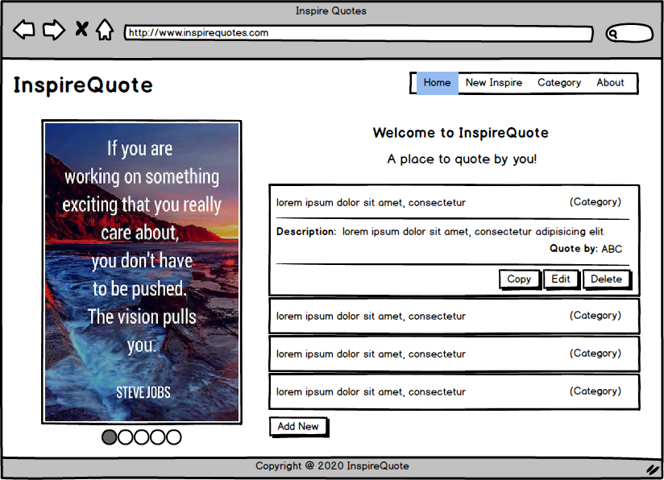
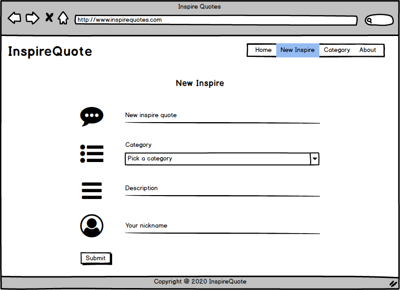
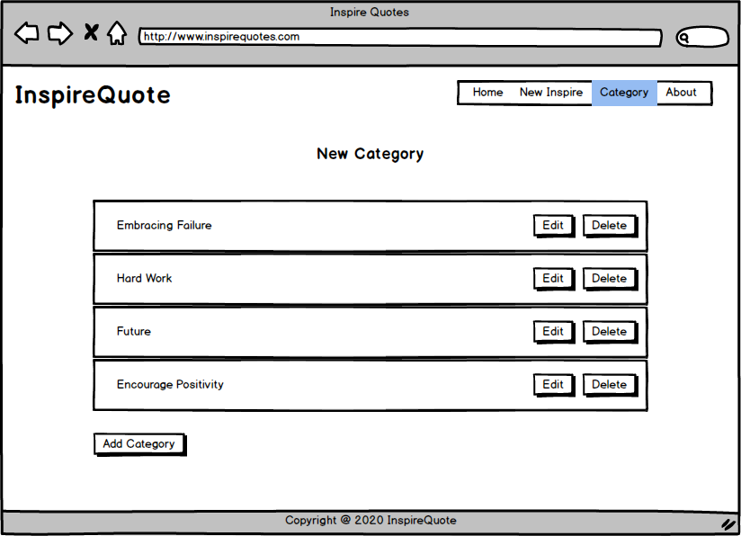
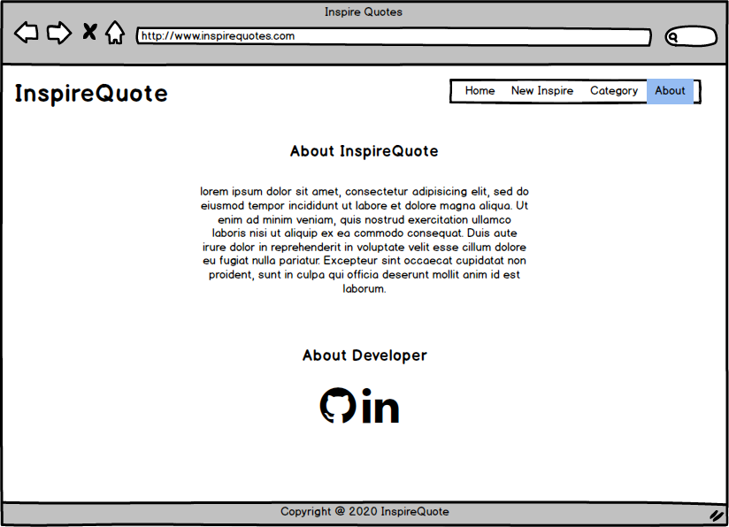
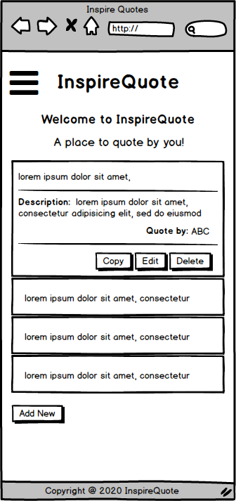
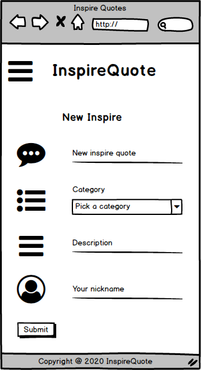
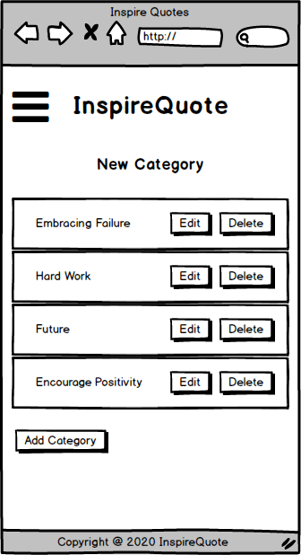
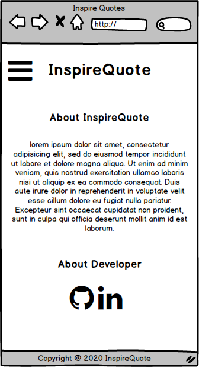

# Inspire Quote
###### Code Institute / Data Centric Development

This project started during the lockdown due to the COVID-19 in majority places in the world. Whether you are working or studying, all the movements are in restriction. Being positive is good for us when working or studying remotely at home. It is good for our health. It is good for our social relationships. It is also good to have a good emotion when we are dealing on something on hands. We need positive energy to withstand the global pandemic or whenever we in needs.

Inspire Quote is a site project that giving us a place to quote and encourage by own! With the connection to MongoDB, the user is allowed to create, read, update and delete (CRUD) to any of the quote by using this site. Everything just "do it yourself"!

The deployed website: **[InpireQuote](https://inspire-quote.herokuapp.com/)**

## UX
### User Stories
- As a user, I want to be able to create a new quote or a new category for the quote.
- As a user, I want to be able to read the quotes or the categories after the creation of it.
- As a user, I want to be able to update the present quotes or the categories.
- As a user, I want to be able to copy the quotes or it's description.
- As a user, I want to be able to delete the present quotes or the categories.
- As a user, I want to understand the purpose of the site.
- As a user, I want to know more about the developer.

### Wireframes
The wireframes were created at the beginning of the project. The final site are similar to the created wireframes, yet do differ as adding some instructions to the Home page.

#### Desktop View
##### [Home] [New Insire] [Category] [About]
&nbsp;
&nbsp;
&nbsp;


#### Mobile View
##### [Home] [New Insire] [Category] [About]
&nbsp;
&nbsp;
&nbsp;


## Features
### Existing Features
##### Features 1 - Materialize Navbar with Logo & Menu
- **Materialize Navbar with Logo:** Containing the name of the site. The site will reload or back to Home page when user click on it.
- **Materialize Menu** Display the main pages of the site. The user can go to each page by select each of it.

##### Features 2 - Footer
- The footer contain a short line of text for copyright notice.

##### Features 3 - Materialize Carousel, Collapsible & Sidenav
- **Materialize Carousel:** Used to present the 5 images in quote in 5.5 seconds each or swiping by the user.
- **Materialize Collapsible:** Used to hide the description and will be expanded when clicked on. 
- **Materialize Sidenav:** Used as the slide out menu in tablet or in mobile view.

##### Features 4 - Materialize Button, Icon & Font Awesome Icon
- **Materialize Button:** Used to add, edit, submit and delete the data at database.
- **Materialize Icon:** Used to display as icon at the page of the site.
- **Font Awesome Icon:** Used to display GitHub page for this project and the Linkedin account for developer.

##### Features 5 - Materialize Text Input & Form Select
- **Materialize Text Input:** Used to receive user inputted data.
- **Materialize Form Select:** Used to present specified options for user input.

##### Features 6 - Data in MongoDB
- Data in NoSQL, the document-based database has been used to display the information on 30 ready quotes at the site.

### Future Features
##### User Login
- The user login can be implemented to let the registered user to have their own account and to work on their own quotes at the database.

##### Warning during Data Deletion
- A warning can be displayed when the user decided to delete a quote by click on Delete button. This is to avoid the accidentally of quote deletion.

## Technologies Used
#### [Balsamiq](https://balsamiq.com/)
- Balsamiq was used to design and create the wireframes before starting this project.

#### [Gitpod Online IDE](https://www.gitpod.io/)
- Gitpod Online IDE was used to write the HTML5, CSS3, JavaScript and Python 3.

#### [Materialize 1.0.0](https://materializecss.com/)
- Materialize 1.0.0 used for responsive front-end layout based on Material Design.

#### [Materialize Social](https://terrymooreii.github.io/materialize-social/)
- Materialize Social used to implement the FontAwesome icon as the social login buttons for Materialize to Github and Linkedin. To do this, I have installed:
<br>`npm install --save materialize-social`
<br>`bower install --save materialize-social`

#### [Google Font](https://fonts.google.com/)
- Google Fonts: Courgette imported to the site to be the font for site logo.

#### [HTML5](https://en.wikipedia.org/wiki/HTML5) & [CSS3](https://en.wikipedia.org/wiki/Cascading_Style_Sheets#CSS_3)
- HTML5 used to create the layout for each of the page for the site.
- CSS3 used to style the layout of the site.

#### [JavaScript](https://en.wikipedia.org/wiki/JavaScript)
- JavaScript used to set the primary function of the site for user interaction.

#### [Python 3](https://www.python.org/)
- Python 3 used to develop the site and connect the site to MongoDB.

#### [favicon.cc](https://www.favicon.cc/)
- Favicon used to convert image to .ico format to be used as the icon at the browser tab.

#### [FLATICON](https://www.flaticon.com/)
- Flaticon used to get the image for the icon at the browser tab in .png format.

#### [Design Wizard](https://www.designwizard.com/template/recreation/inspirational-quotes-images/)
- Design Wizard used to design and create the inspirational quote images in carousel at the site.

#### [MongoDB](https://www.mongodb.com/)
- MongoDB that classified as a NoSQL database program, used as the database to the site. 

#### [Git & GitHub](https://github.com/)
- Git used for version control, and Github used as a remote repository.

#### [Heroku](https://heroku.com/)
- Heroku used as the hosting of the site.

## Testing
The site testing was done throughout the development by using a test sheet in Excel file. To get this done, I have set 
```python 
debug=True
```
This is to ensure the site to display the errors to notify what caused the crash.

Various tests have been done to ensure the site is working properly. Throughout the test, the site rendering well at most of tested devices and the CRUD behaves as intended.

This is the [test sheet](testing/test-sheet.xlsx)


Once the CRUD functions was in placed, I have tested each of it at the Inspire Quote and Category in multiple times and to perform unexpected. From here I have ensured the CRUD functions at the site is working as intended.

The Validators for HTML, CSS & JS are used, no warning or error found. Yet, the warnings or errors are there due to missing lang, doctype, header and bad value found caused by the jinja quote at the render templates. I cannot do anything to this as we need to create every HTML page by referring to the base.html.

Browser on Chrome, Firefox and IE were used to test the browser compatibility. The site displayed without any issue, except to the IE that showing the color issue at the Navbar and the Footer.

Chrome DevTools were used to test the responsiveness of the site on Galaxy Note 3, iPhone 6/7/8 Plus and iPad Mini. There is no issue encountered.

The site also been tested by walking through each user story. The users were able to do everything that mentioned at the user story.

### Known Issue
The Carousel is not loaded properly in the browser. I will need to reload few times in order to get the Carousel to work as expected.

## Deployment
During the deployment of the site, I have to ensure the below:
1. At Heroku, create new app named inspire-quote and go to Deploy tab. At the Deployment Method section, select GitHub. After the Connect to GitHub section is shown, fill in the repo-name of the site at GitHub and click Search. Connect to the correct repo at GitHub. Upon successul on the deployment, Heroku will give the URL that hosted the site at Domains section under Settings tab.
2. Removing all the environment variables to the MONGO_URI and the SECRET_KEY. These 2 were placed in env.py during the development and have been entered to Config Vars at Heroku for deployment.
3. Make sure the requirements.txt is up-to-date with all the latest packages installed for the site by using `pip3 freeze > requirements.txt`
4. Creating Procfile that required by Heroku to run the site by using `echo web: python app.py > Procfile`
5. Set the Flask debugging to False.
6. Push all the updated code to Github.
7. All the updated code that have been pushed to GitHub will be updated automatically to the deployed site at Heroku.

## Credits
### Content
- The site was designed and completed by myself. All text and quote were written with reference on:
    - [BrightDrops](https://brightdrops.com/daily-inspirational-quotes)
    - [Brian Tracy](https://www.briantracy.com/blog/personal-success/26-motivational-quotes-for-success/)

### Media
- The carousel images was sourced and designed by using [Design Wizard](https://www.designwizard.com/template/recreation/inspirational-quotes-images/).
- The browser icon for the site was sourced from [FLATICON](https://www.flaticon.com/).

### Acknowledgements
- Special thanks to [Dick Vlaanderen](https://github.com/dickvla), my mentor from Code Institute, for his valuable advice and guidance.
- Thank you to the Tutor Support at Code Institute for the valuable feedback.
- The idea of the site mainly from myself with the reference of [BrightDrops](https://brightdrops.com/daily-inspirational-quotes) and [Brian Tracy](https://www.briantracy.com/blog/personal-success/26-motivational-quotes-for-success/).
- In the middle of the project, I refer to [w3schools.com](https://www.w3schools.com/), [stackoverflow](https://stackoverflow.com/) and the video lessons from [Code Institute](https://codeinstitute.net/).
